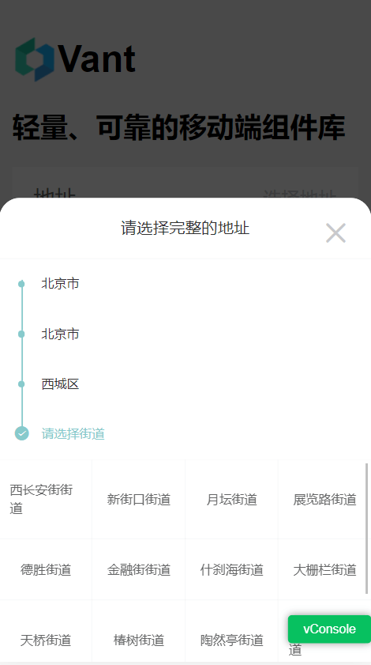

# vant-address

基于 vue vant UI 组件下扩展扁平化地址组件，可多级别设置

## Install

```js
yarn add vant-address
```

### 注：项目中需要先安装 vant 组件，参考 vant 官方文档

```js
https://vant-contrib.gitee.io/vant/#/zh-CN/
```

### 效果如下



### API

#### prop

| 参数          | 说明                        | 类型     | 默认值             |
| :------------ | :-------------------------- | :------- | :----------------- |
| title         | 弹窗地址选择文案说明        | String   | 请选择所在地区     |
| showNavBar    | 是否显示弹窗文案头          | Boolean  | true               |
| level         | 可选地址层级                | Number   | 4                  |
| action        | 请求获取地址                | Function | 必传               |
| params        | 初始化请求参数              | Object   | 必传               |
| data          | 已选择的数据对象            | Array    | []                 |
| itemKey       | 地址列表中根据 key 显示文案 | String   | title              |
| activeColor   | 选中颜色                    | String   | rgb(135, 202, 204) |
| navBarStyle   | 弹窗头部样式                | Object   | {}                 |
| stepStyle     | 地址单元格样式              | Object   | {}                 |
| gridItemStyle | 选中进步条区域样式          | Object   | {}                 |
| debug         | 调试模式                    | Boolean  | false              |

## Example

```js
<template>
  <div class="main">
    <h1 class="title">
      <span>Vant</span>
    </h1>
    <h2>
      轻量、可靠的移动端组件库
    </h2>
    <van-field
      readonly
      clickable
      label="地址"
      size="large"
      rows="1"
      type="textarea"
      autosize
      input-align="right"
      error-message-align="right"
      :value="address"
      placeholder="选择地址"
      :rules="[{ required: true, message: '请选择地址' }]"
      :loading="true"
      @click="choseAddress"
    />
    <van-popup v-model="showPicker" round closeable position="bottom">
      <Address
        ref="addressPicker"
        :debug="false"
        :data="selectLivingData"
        title="请选择完整的地址"
        :level="level"
        :action="getAddressByCode"
        :showNavBar="showNavBar"
        :params="params"
        :stepStyle="stepStyle"
        :gridItemStyle="gridItemStyle"
        @cancel="showPicker = false"
        @confirm="onConfirm"
      ></Address>
    </van-popup>
  </div>
</template>
<script>
import Address from "vant-address";
import { getActionCache } from "@/utils/manage";
export default {
  components: {
    Address,
  },
  data() {
    return {
      address: "",
      selectLivingData: [], //已选择现住址
      showPicker: false,
      level: 4,
      params: { pid: "86" },
      showNavBar: false,
      stepStyle: { fontSize: "14px" },
      gridItemStyle: { fontSize: "14px" },
    };
  },
  methods: {
    choseAddress() {
      this.showPicker = true;
      setTimeout(() => {
        this.$refs.addressPicker.initAddress();
      }, "500");
    },
    //获取下级地址 params:{pid:86}
    async getAddressByCode(params) {
      const res = await getActionCache("address/get/list", params);
      if (res.code === 200 && res.success) {
        return res.result;
      } else {
        this.$message.warning(res.message);
      }
    },

    onConfirm(value) {
      this.selectLivingData = value;
      if (value.length >= this.level) {
        this.showPicker = false;
        this.address = value.map((v) => v.title).join();
      }
    },
  },
};
</script>
<style lang="less">
.main {
  height: 100vh;
  width: 100%;
  box-sizing: border-box;
  font-size: 14px;
  padding: 10px;
  text-align: left;
}
.title {
  display: flex;
  flex-direction: row;
}
.title img {
  width: 34px;
  height: 34px;
}
</style>
```
